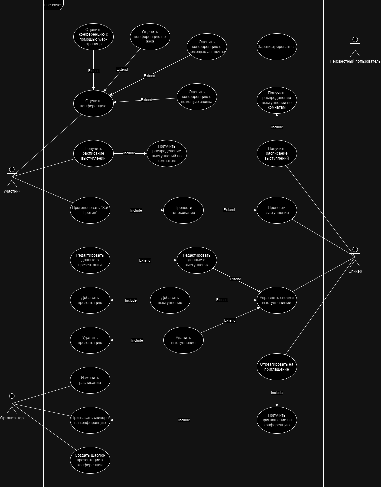

# Формулирование требований к разрабатываемой ИС

## Перечень заинтересованных лиц

**Перечень стейкхолдеров состоит из следующих элементов**:

- Организаторы конференций: человек / группа лиц, которые занимаются организацией конференций.

- Спикеры конференций: люди, выступающие во время конференций.

- Участники конференций: слушатели конференций, которые располагаются в специально отведённых для просмотра конференции местах.

- Владельцы почтовых сервисов: компании, управляющие почтовыми сервисами.

- Операторы сотовой связи: компании, управляющие телефонной коммуникацией посредством SMS, MMS и звонков.

## Перечень функциональных требований

**Перечень функциональных требований состоит из следующих элементов**:

- Участники должны иметь возможность получить доступ к расписанию выступлений онлайн, включая распределение комнат.

- Спикеры должны иметь возможность управлять своими выступлениями (Добавлять, редактировать, удалять).

- Спикеры должны иметь возможность начинать голосования.

- Участники беседы во время проведения голосований «голосуют за/против».

- Организатор должен иметь возможность редактировать расписание.

- Каждая конференция (будучи отдельной темой) может быть независимо оформлена.

- Участники конференции должны иметь возможность просмотреть слайды докладчиков, которые выступали на этой конференции.

- Оценка конференции должна быть доступна с помощью веб-страницы, электронной почты, SMS и по телефонному звонку.

## Диаграмма вариантов использования

**Диаграмма вариантов использования** представлена ниже.

## Перечень предположений

**Перечень предположений** по требованиям:

- Для допуска к системе человек должен пройти регистрацию.

- Спикер может выступать с несколькими докладами на одной конференции.

- Организатор должен иметь возможность создавать конференции.

- Организатор должен иметь возможность приглашать спикеров на конференцию.

- Организатор должен иметь возможность создавать шаблон презентации к конференции.