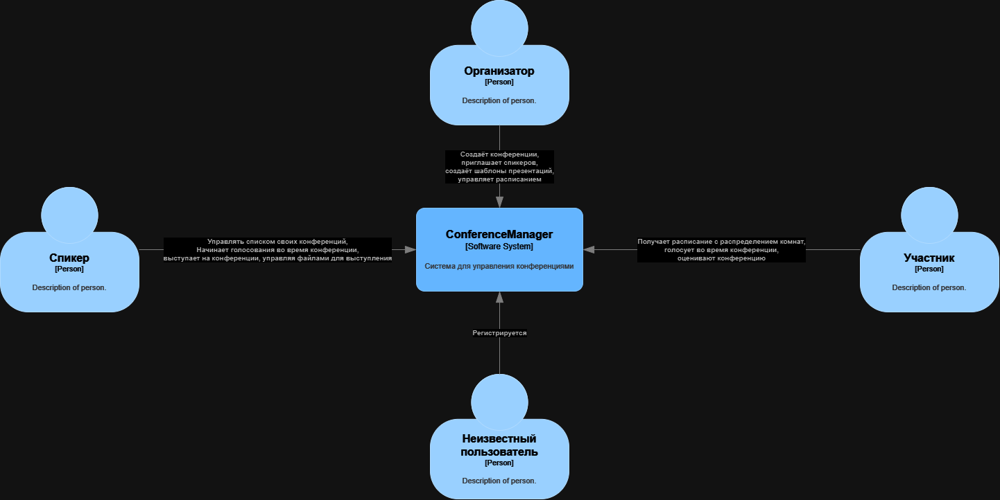
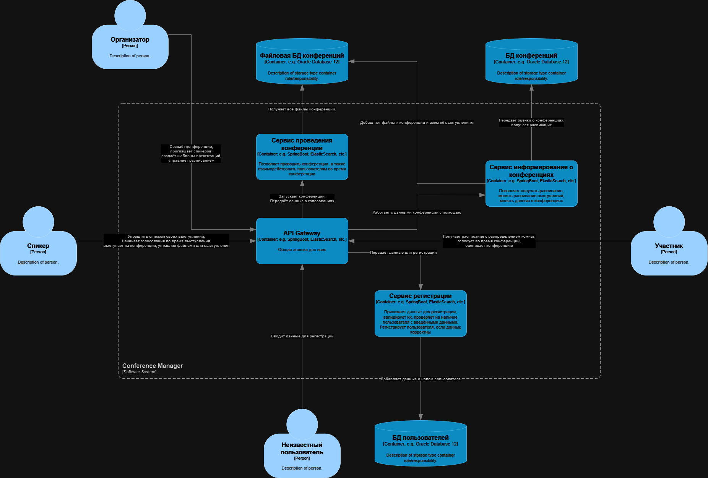

# System context diagram

Контекстная диаграмма системы "ConferenceManager" представлена ниже:

# Container diagram

Далее углубляемся в саму систему и описываем контейнерную диаграмму:

# Описание

Архитектурный стиль системы - микросервисный.

Система состоит из 3 отдельно работающий приложений:

- Сервис регистрации. Доступ к системе разрешён только зарегистрированным пользователям, поэтому нам необходим этот сервис.

- Приложение для управления конференциями. Это приложение даст возможность организатору настроить конференцию перед запуском, пригласить спикеров, спикеры смогут подготовить свои выступления, а участники смогут посмотреть расписание.

- В дополнение к приложению управления конференциями идёт сервис оповещений, который будет уведомлять участников и спикеров об изменении в расписании, а также отправлять им важные новости. Сам сервис оповещает пользователей с помощью стороннего сервиса почты.

- Приложение для проведения конференции. С помощью этого приложения будут проводиться выступления на конференции. Для каждого выступления приложение будет подгружать необходимые файлы, а спикер сможет их демонстрировать так, как ему удобно.

# Взаимодействие систем и подсистем

Взаимодействие будет происходить только в двух случаях:

- Между Приложением для управления конференциями и Сервисом оповещений.

- Между Сервисом оповещений и сторонним Сервисом почты.

В обоих случаях взаимодействие будет происходить с помощью HTTP-запросов (на самом деле, я бы в первом случае использовал брокер сообщений, но диаграмму перерисовывать третий раз не хочу).