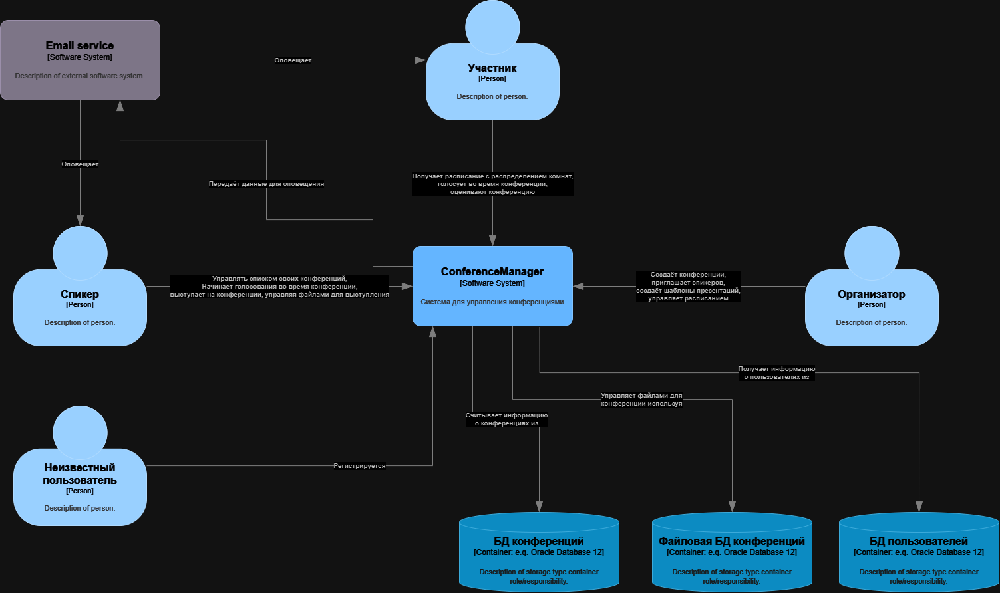
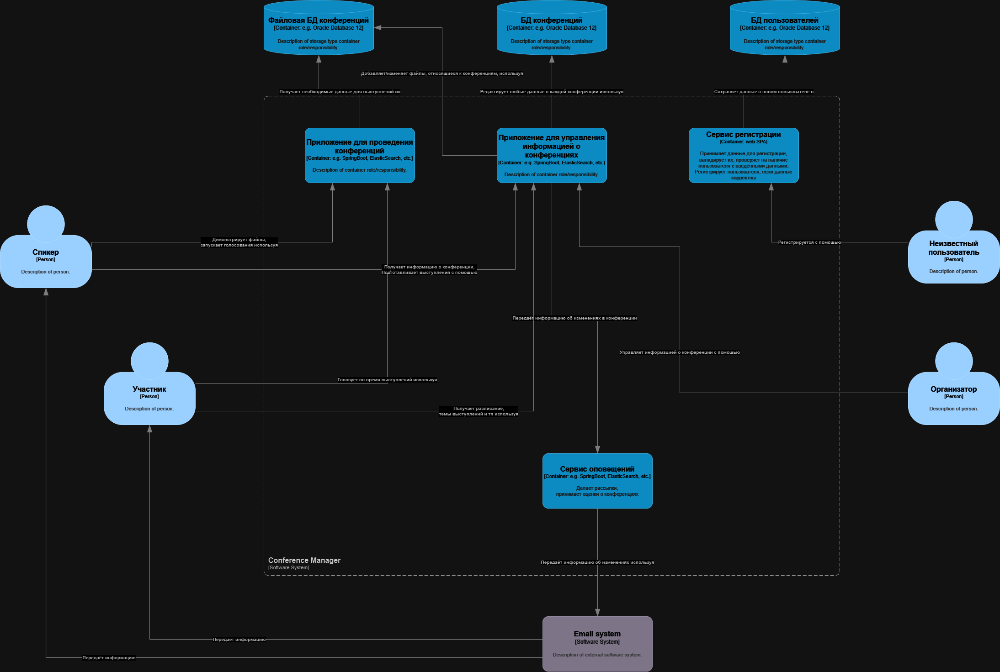

# System context diagram

Контекстная диаграмма системы "ConferenceManager" представлена ниже:

Далее углубляемся в саму систему и описываем контейнерную диаграмму:

Для всех видов пользователя есть единая API, которая делегирует задачи на соответственные сервисы.
Всего есть 3 основных сервиса:

- Сервис регистрации. Он направлен на неизвестных пользователей.

- Сервис проведения конференций. Сервис собирает все необходимые файлы для спикера и даёт ему возможность демонстрировать их. Также именно этот сервис позволяет собирать статистику с голосований на выступлениях.

- Сервис информации о конференциях. Этот сервис является подготовительным к проведению конференции. Он занимается добавлением/изменением информации о каждом выступлении, позволяет манипулировать расписанием, а также именно он даёт возможность организатору создать специальный шаблон для каждой конференции.

Также на уровне контейнеров мы уже понимаем, что нам необходимы базы данных для работы всей системы.
Для работоспособности системы мы заводим 3 базы данных:

- БД пользователей. Предоставляет информацию о всех зарегистрированных пользователях.

- Файловая БД конференций. БД содержит все необходимые файлы для проведения каждого выступления каждой конференции, включая презентации, видеозаписи и прочее.

- БД конференций. База данных содержит всю информацию о каждой конференции, включая выступления, распределения по комнатам, расписание, участников и тд.