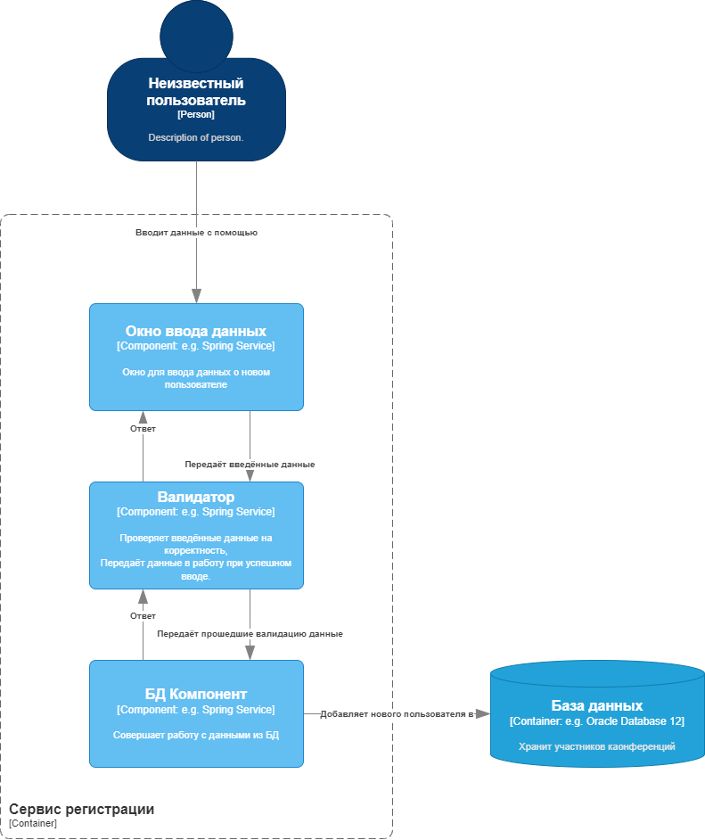

# 3 лабораторная работа

## Диаграмма компонентов

Диаграмма компонентов была описана для контейнера "Сервис регистрации".

На диаграмме можно заметить, что контейнер состоит из 3 компонентов: Окно вводаданных, Валидатор и БД Компонент.

### Окно ввода

Окно ввода это обычная формочка для отправки данных, которая содержит все обязательные и необязательные поля.

### Валидатор

После ввода данных пользователем, они передаются валидатору. Валидатор проверяет по шаблонам корректность введённых данных (например, имя не содержит цифр). В зависимости от статуса валидации Валидатор либо вернёт Окну ввода информацию об ошибке, либо передаст проверенные корректные данные в компонент БД_Компонент.

### БД Компонент

БД Компонент осуществляет всю работу с БД. После передачи ему данных, он заносит нового пользователя в БД.

## Диаграмма последовательности

По диаграмме последовательности можно заметить, что работу контейнера похода на Middleware. 
Суть работу контейнера в том, что если на каком-то из этапов возникает исключение, ошибка и тп, то дальше в работу данные не передаются, а пользователю будет выводиться соответственное ситуации сообщение.

## Диаграмма Классов - БД

Диаграмма классов состоит из 6 таблиц:
- Пользователь
- Устройство
- Пол
- Адрес проживания
- Населённый пункт
- Страна

### Связи
- Пользователь может владеть несколькими устройствами. Устройства без пользователя не может существовать.
- Пользователь имеет пол.
- У Пользователя есть адрес проживания. Причем по одному адресу могут проживать несколько Пользователей.
- В адрес проживания входит Населённый пункт.
- Населённый пункт относится к конкретной стране.