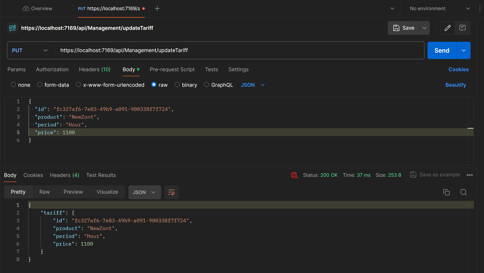
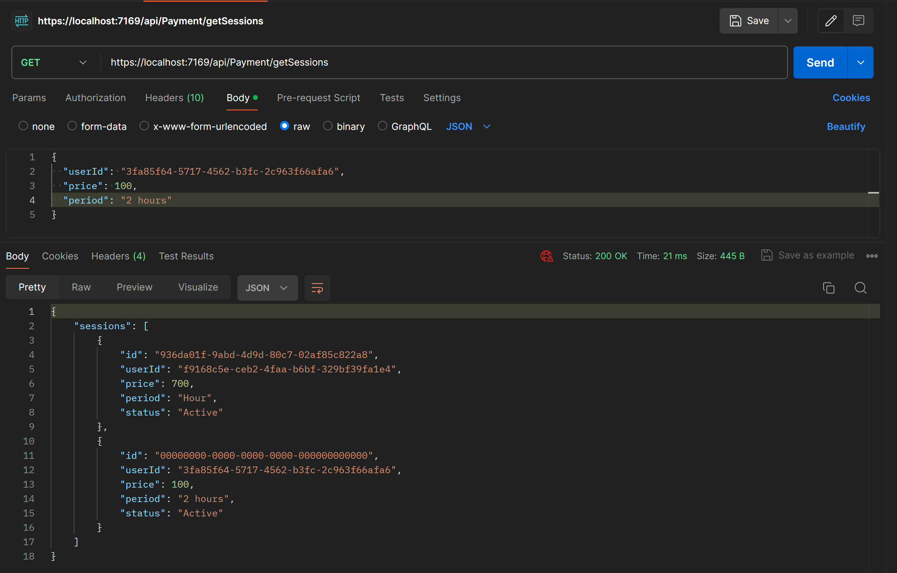

# Лабораторная работа №4

Тема: Проектирование REST API

Цель работы: Получить опыт проектирования программного интерфейса

## Документация по API

### Контроллер Management

Контроллер включает в себя методы для реализации CRUD-операций по тарифам, которые включают в себя id, product, period и price.

- HttpGet: на вход не имеет параметров, на выход отдаёт список tariffs, который включает в себя объекты из четырёх полей, указанных ранее.
- HttpPost: на вход получает параметры Product, Period, Price. На выход отдаёт полность заполненный созданный объект с теми же параметрами и дополнительным Id
- HttpPut: На вход получает все 4 поля тарифа, ищет тариф в системе с таким же Id, после чего заменяет все поля найденного объекта на параметры из запроса.
- HttpDelete: Получает Id объекта, удаляет его из системы и на выход отдаёт все параметры удалённого объекта.

### Контроллер Refund

Контроллер включает в себя 2 метода на получение списка возвратов денежных средств и на создание объекта возврата

- HttpGet: не имеет параметров на вход, на выходе даёт список их обхектов с полями Id и Price
- HttpPost: Получает на вход UserId и SumOfMoney, создаёт обхект в системе и вовзвращает созданный объект в качестве ответа.

### Контроллер Statistics

У контроллера есть 2 метода: Get и Post на получение списка всех сессий аренды и добавление новой сессии.

- HttpGet: Не имеет параметров на вход, на выход отдаёт список объектов с параметрами UserId, Price, StartTime, EndTime
- HttpPost: На вход получает все 4 поля, создаёт объект в системе и возвращает этот объект в ответе.

### Контроллер Payment

У контроллера есть 2 метода: Запуск процесса сессии аренды и получение списка таких запусков. На скрине можно заметить третий метод, однако он не описан, поэтому в отчёте не будет учитываться.

- HttpGet: Не имеет входных параметров, на выходе отдаёт список из объектов сессий, включающих Id, UserId, Period, Price, Status
- HttpPost: На вход получает UserId, Period, Price. На выход отдаёт созданный объект запущенной сессии.

## Тестирование API

### Management.Get

### Management.Post

### Management.Put

### Management.Delete

### Refund.Post

### Refund.Get

### Statistics.Post

### Statistics.Get

### Payment.Post

### Payment.Get

